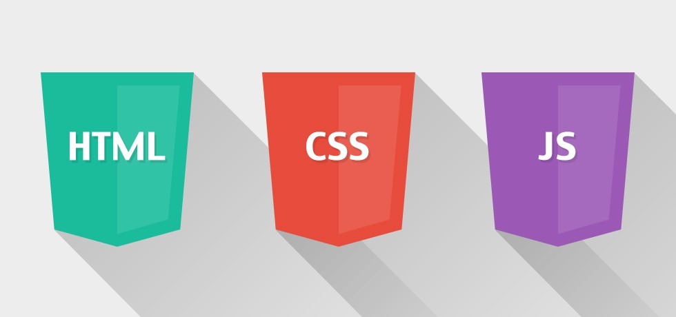

# Front-End Stack \(Guide to become Full Stack Developer\)

## Front-End Stack \(Guide to become Full Stack Developer\)

Have you ever looked at your favorite website and wondered exactly what made it tick? Have you looked at the way it was laid out, the way the buttons acted when you clicked them, or any other part and thought, **“I wonder how complicated that is?”** or, **“I wish I could do that”**?

All of those things are Front-End development. While web design is the way a website looks, Front-End development is how that design actually gets implemented on the web. Basically, Front-End web development is the practice of converting data to a graphical interface for the user to view and interact with data through digital interaction using HTML, CSS, and JavaScript. And, Front-End development is a part of Full-Stack Development as we have covered in our previous article, and for becoming a Full-Stack developer one must practice Front-End Development. A Front-End developer is also known as a client end developer.

So, now the question is that, **“How can I learn and become a Front-End Developer?”**. For becoming a Front-End developer that the pathway is:

### The Basics: 

HTML/CSS/JS these are the basic building block of any website design.

HTML is the foundation of any website and has been since Al Gore invented the Internet. HTML can be used to add text, images, audio, video, forms, tables, and more to your website.

CSS is also a cornerstone of web development and it’s going to be your best friend and worst enemy all in the same day. HTML describes what’s on the page and CSS describes how it should look.

So, we’ve got our content on the page and its got a nice coat of paint on it thanks to CSS, but it’s still going to feel pretty static. Let’s bring some motion and action! I want to click a button and have dollar bills start raining down the page. JavaScript can help you make it rain. JavaScript can be used for triggering events, inserting/removing elements from our page, creating pop-ups, and yes — “making it rain”.

### Responsive Design & Design Guides: 

Naturally and automatically adjusting on the fly is a critical part of success in nature, sports, business — and even web design. Perfecting responsive web design is a marketing concept that allows your website to effectively adjust instantly on all your customer’s devices. “It keeps users where you want them; on your site.” In the US alone, more people access the internet from their mobile device than from a desktop computer, so it’s no wonder that responsive and mobile design skills are super important to employers. Responsive design means that the site’s layout \(and sometimes functionality and content\) change based on the screen size and device someone is using. So, for that, we need to know the advance CSS & JS to make our website responsive and at the same time, we need to know the fundamental design guidelines provided by different organizations, like for instance Material design by Google, Metro Design by Microsoft etc.

### JavaScript & Front-End Frameworks: 

**JavaScript Frameworks:** JS frameworks \(including AngularJS, Backbone, Ember, and ReactJS\) give a ready-made structure to your JavaScript code. There are different types of frameworks for different needs, though the four mentioned are the most popular in actual job listings. These frameworks really speed up development by giving you a jumpstart and can be used with libraries like jQuery to minimize how much from-scratch coding you have to do.

**Front End Frameworks:** CSS and front-end frameworks \(the most popular front-end framework is Bootstrap\) do for CSS what JS Frameworks do for JavaScript: they give you a jumping-off point for faster coding. Since so much CSS starts with exactly the same elements from project to project, a framework that defines all of these for you upfront is super valuable.

